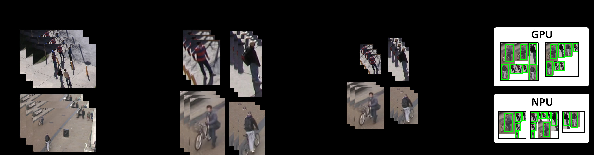

<div id="top"></div>

# Mondrian

On-device high-performance video analytics with compressive packed inference.

**Paper**: [Mondrian: On-device high-performance video analytics with compressive packed inference](https://arxiv.org/abs/2403.07598)

<p align="center">
  <video src="demo.mp4" autoplay loop muted playsinline width="100%"></video>
</p>

<p align="center">
  
</p>

## Overview

Mondrian is a multi-stream video analytics system that performs spatio-temporal packing of regions of interest (ROIs) for efficient object detection on Android devices. Tested on Ubuntu 22.04 with Galaxy S22, S23, and S25. It consists of:

- **Offline stage** (`offline/`): Prepare TFLite detection models and a scale estimator
- **Android runtime** (`android/`): Build and deploy the on-device inference pipeline

The end-to-end workflow is:

1. **Setup** (`./setup.sh`): Automatically creates the conda environment, exports TFLite models, installs the Android SDK, extracts native dependencies, and builds the APK.
2. **Deploy & Run** (`./run.sh`): Installs the APK and launches the app on a connected device.

> To fine-tune models on your own data or train a custom scale estimator, see [FINE_TUNING.md](FINE_TUNING.md).

## Prerequisites

Install the following before proceeding:

```bash
# JDK 17+ (required by Android SDK command-line tools and Gradle)
sudo apt install openjdk-17-jdk

# Conda (required for offline stage Python environment)
# See https://docs.conda.io/en/latest/miniconda.html
```

Download native dependencies (~540 MB, not included in the repository):
1. Download `mondrian-dependencies.zip` from [OneDrive](https://1drv.ms/u/c/37b8a46db9d487d9/IQC1d7OHyUsgRYAUEit4uQ8MAbNHepXr5sJAlwkK_j4Vu1k?e=kc65q4)
2. Place it in the `android/` directory

## Step 1: Setup

`setup.sh` automates the entire build pipeline — conda environment, TFLite model export, Android SDK installation, native dependency extraction, and APK build. If a device is connected, it also pushes models to the device.

```bash
./setup.sh
```

Each stage checks whether it has already been completed and skips accordingly, so re-running is safe.

## Step 2: Deploy & Run

Connect an Android device via USB debugging or wireless debugging:

```bash
adb devices  # should list your device
```

**Quick start with the included example** (5-second clip from [MOT17-04](https://motchallenge.net/data/MOT17/)):

`setup.sh` already pushes the example video and config to the device, so you can run immediately:

```bash
./run.sh
# Running... [████████████████░░░░░░░░░░░░░░░░░░░░░░░░]  40%
```

**Using your own video:**

```bash
# Push video
adb push <video_file> /data/local/tmp/video/

# Edit example/config.json (set video_configs.path, num_frames, fps, etc.)
adb push example/config.json /data/local/tmp/config.json

./run.sh
```

The script installs the APK, starts the app, and displays a live progress bar until processing completes. Press `Ctrl+C` to stop monitoring (the app continues running on the device).

After modifying source code, rebuild and re-deploy with:

```bash
./build.sh   # incremental build (faster than setup.sh)
./run.sh     # install + launch
```

## Step 3: Collect & Interpret Results

Pull log files from the device:

```bash
./pull.sh
```

This saves logs to `logs/<run_id>/` and prints a summary of files and sizes.

The log directory (`log_dir` in config.json) contains:

| File | Description |
|------|-------------|
| `progress` | Processing progress (0.000 to 1.000) |
| `config.json` | Copy of the config used for this run |
| `boxes.csv` | Per-frame detection results (bounding boxes, confidence, label) |
| `frame.csv` | Per-frame statistics (ROI counts, inference timing, scheduling) |
| `roi.csv` | Per-ROI tracking details (location, scale, packing, probing) |
| `trace.json` | Chrome Trace format performance profile (open in `chrome://tracing`) |

**Key columns in `boxes.csv`:**

| Column | Description |
|--------|-------------|
| `vid`, `fid` | Video stream ID, frame ID |
| `box_l/t/r/b` | Bounding box coordinates (left, top, right, bottom) |
| `confidence` | Detection confidence score |
| `origin` | How the box was produced (`NEW_FULL_FRAME`, `PACKED`, `INTERPOLATED`, etc.) |

**Key columns in `frame.csv`:**

| Column | Description |
|--------|-------------|
| `numROIs`, `numMergedROIs` | Number of ROIs before/after merging |
| `numBoxes` | Number of detected bounding boxes |
| `inferenceFrameSize` | Model input size used for this frame |
| `enqueueTime`, `endTime` | Frame processing start/end timestamps (microseconds) |

## Configuration

Runtime behavior is controlled by `android/config.json`:

| Field | Description |
|-------|-------------|
| `video_configs` | Input video paths, frame count, FPS |
| `inference_engine.full_model` | Full-frame detector model path |
| `inference_engine.worker_configs` | Packed canvas detector models per device |
| `inference_engine.draw_inference_result` | Enable on-screen visualization |
| `roi_resizer.dataset` | Scale estimator dataset (`mta` or `virat`) |
| `log_dir` | Output log directory on device |
| `log_boxes`, `log_roi`, `log_frame` | Enable logging per category |

## Architecture

### Threading Model

The runtime pipeline consists of 7 threads in a producer-consumer chain:

1. **VideoLoader** — decodes video frames (YUV)
2. **ROIExtractor::PDThread** — person detection to extract ROIs
3. **ROIExtractor::OFThread** — optical flow tracking + PD filtering
4. **ROIExtractor::PostprocessThread** — ROI scaling and merging
5. **Mondrian::scheduleThread** — inference scheduling + ROI packing
6. **Mondrian::postprocessThread** — bounding box reconstruction + interpolation
7. **Mondrian::logThread** — writes results to log files

Each thread communicates via named queues (`PDWaiting_` → `OFWaiting_` → `PostprocessWaiting_` → `Processed_` → `packingResults_` → `results_`).

### Code Structure

```
setup.sh                    # One-time build pipeline (conda, models, SDK, APK)
build.sh                    # Incremental APK build (after code changes)
run.sh                      # Deploy APK, launch, and monitor progress
pull.sh                     # Pull log files from device

example/                    # Example video and config
├── MOT17-04_5s.mp4         # 5s clip from MOT17-04 (1080p, 30fps)
└── config.json             # Matching config for the example video

offline/                    # Offline model preparation
├── export_tflite.py        # YOLO .pt → TFLite conversion
├── label_frames.py         # Auto-label video frames
├── pack_canvases.py        # Generate packed canvas images
├── train_scale_estimator.py
└── finetune_packed_detector.py

android/                    # Android runtime
├── config.json             # Runtime configuration
└── Mondrian/src/main/
    ├── java/.../mondrian/  # Java layer (UI, JNI bridge)
    └── cpp/
        ├── jni/            # JNI bridge
        └── mondrian/       # C++ engine
            ├── src/        # Pipeline implementation
            └── include/    # Headers
```

## Contact
* Changmin Jeon - wisechang1@snu.ac.kr
* Seonjun Kim - seonjun.kim@hcs.snu.ac.kr
* Project Link: [https://github.com/snuhcs/mondrian](https://github.com/snuhcs/mondrian)

## Citation

If you find our work useful, please cite our paper:

```bibtex
@article{jeon2024mondrian,
  title={Mondrian: On-device high-performance video analytics with compressive packed inference},
  author={Jeon, Changmin and Kim, Seonjun and Yi, Juheon and Lee, Youngki},
  journal={arXiv preprint arXiv:2403.07598},
  year={2024}
}
```
